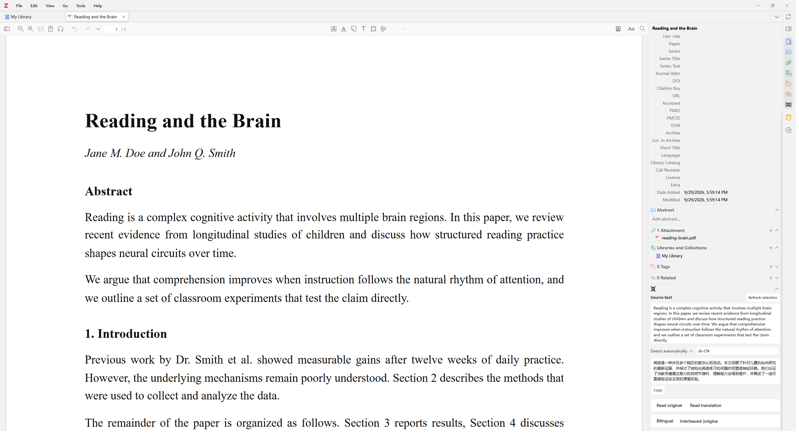
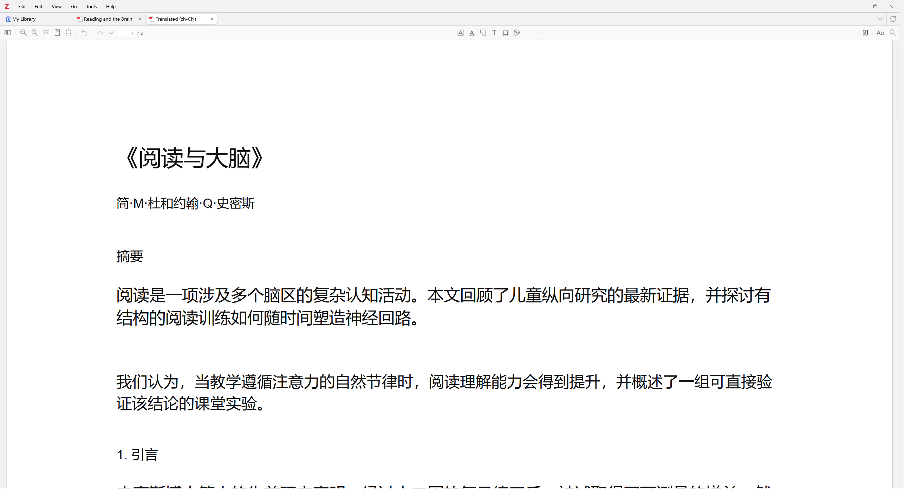
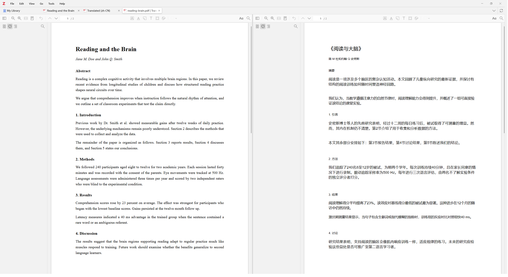
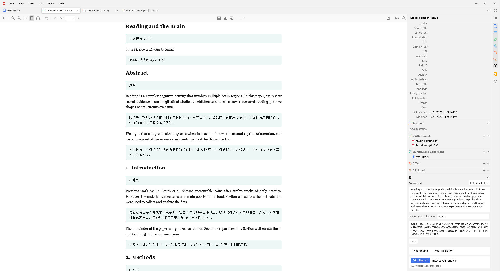
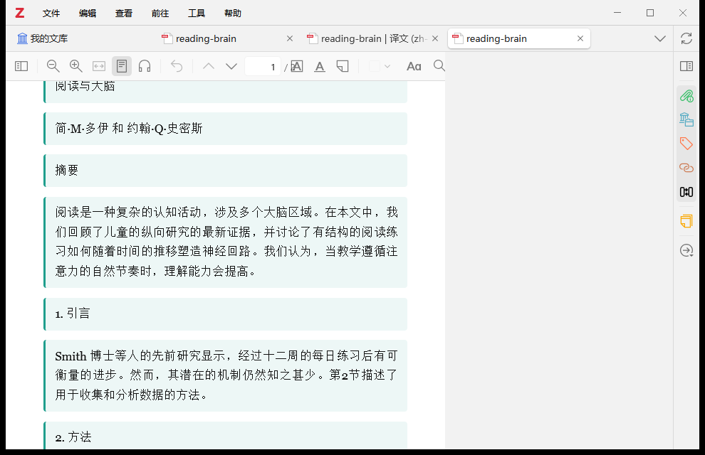
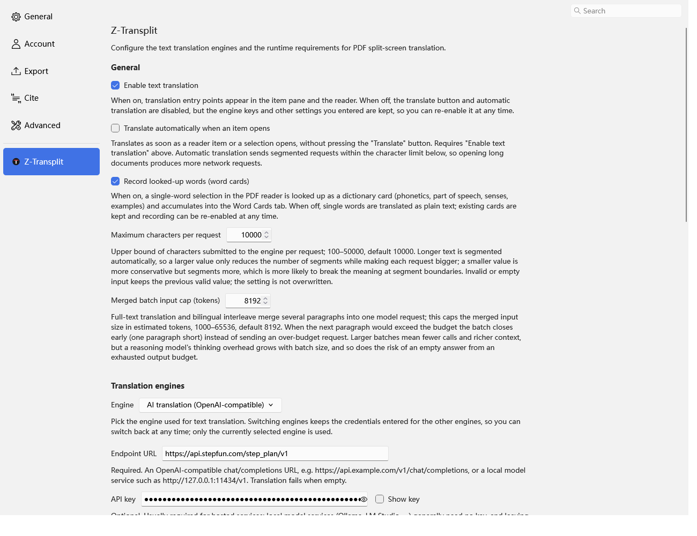

<h1>
  <picture>
    <source media="(prefers-color-scheme: dark)" srcset="addon/content/icons/ztransplit-dark.svg" />
    
  </picture>
  Z-Transplit
</h1>

[English](README.md) | **中文**

**划词翻译 · PDF 保排版全文翻译 · 分屏对照 · 双语对照 · 仅译文 · 朗读 —— 一站式 Zotero 文献翻译插件。**

Z-Transplit 是一个独立的 Zotero 7 / 10 插件，围绕「读外文文献」提供一整套翻译能力：
阅读器划词即时翻译、PDF 保排版全文翻译并生成译文附件、同标签页左右分屏对照、
Zotero 10 阅读模式的上下双语对照与仅译文模式，以及跨会话的翻译缓存和句级朗读。

界面全部用 Zotero 原生 XUL/HTML 构建，不引入 React，也没有 iframe 桥。

## 安装

1. 从 [Releases](../../releases) 页面下载最新的 `z-transplit.xpi`；
2. Zotero ▸ 工具 ▸ 附加组件（插件）▸ 右上角齿轮 ▸ 从文件安装附加组件，选择下载的 xpi；
3. 打开一篇 PDF，右侧「翻译」面板与右键菜单即出现。

## 功能

### 1. 划词翻译

在阅读器中选中任意文本，「翻译」面板给出源文本与译文，可一键复制。支持自动检测源语言、
目标语言框（回车或失焦即提交，输入法组词期间回车不会误触发）、译文朗读。
翻译失败、结果为空、字符超限、引擎未配置都各有明确提示，不会出现静默空窗。

- 源文本区带「刷新选区」按钮，重新读取当前阅读器选区
- 目标语言框回车或失焦即提交；输入法组词期间回车只确认候选词，不触发翻译
- 结果区四种状态：翻译中（骨架微光）／失败（原因 + 重试）／成功（译文 + 复制）／待翻译（「翻译」按钮）
- 复制失败不会丢结果：在完整译文下方追加一条临时失败提示
- 「自动翻译」开启后，选中文本即自动提交，无需再点按钮

### 2. PDF 全文翻译（生成译文附件）

文献列表右键 PDF（或阅读器右键）→「翻译全文（生成译文附件）」。本地 OpenDataLoader
（JVM）解析版面 → 逐段翻译 → 按原版式重排渲染，产物作为「Translated (zh-CN)」附件入库并自动打开。
重复翻译自动去重：已有译文时直接打开，不再重跑。

- 保留原版面：分栏、表格、图片位置按解析结果贴回，中英文混排分段各自用对应字体绘制
- CJK 字体自动解析：按目标语言在系统字体目录中找微软雅黑 / 苹方 / Noto，找不到时明确提示而不是画「豆腐块」；也可在数据目录 `ztransplit/translation-assets` 放入 `translated-regular.ttf` 覆盖，想匹配论文的衬线风格可放思源宋体
- 公式 `$…$` / `{v0}` 先替换为占位标记，译文按位置贴回，默认模板要求模型原样保留
- 多选 PDF 时逐个串行处理，进度窗带序号，单个失败不影响其余

### 3. 分屏对照

右键（阅读器或文献列表）→「翻译并分屏对照」/「对比分屏」：同一个标签页内左右两个阅读器
并排，左右各一个 5px 拖拽分隔条调节比例，滚动、翻页、缩放双向同步，适合逐段精读。

- 「对比分屏」不需要翻译，把当前 PDF 与同一父条目下的另一个 PDF 直接并排
- 「翻译并分屏」没有现成译文时先跑全文翻译，再打开分屏；已有译文则直接复用
- 翻译进行中，右键菜单会出现「取消正在进行的翻译」

### 4. 上下对照双语阅读（Zotero 10）

阅读器右侧「翻译」面板中开启「双语对照」：Zotero 10 的 SDT 阅读模式把 PDF 重排为结构化文本，
每段原文下方插入译文块；视口懒翻译，滚到哪译到哪，进度实时显示 `3/12 段已译`。

### 5. 仅译文模式

同一双语会话内切换到「仅译文」：隐藏原文块，只保留译文，适合通读全文。

> 双语对照 / 仅译文依赖 Zotero 10 的阅读模式；在 Zotero 7 上面板会明确提示降级，
> 其余功能（划词、全文翻译、分屏、朗读）在 7 与 10 上均可用。

### 6. 朗读

双语会话与「翻译」面板均支持朗读（Windows SAPI / 系统 TTS），句级高亮跟随播放进度：
朗读原文走 PDF 文本层定位，朗读译文走双语译文块。支持暂停/继续、上一句/下一句、停止。

## 翻译引擎

设置面板（编辑 ▸ 设置 ▸ Z-Transplit）中切换，全部支持跨会话的内容寻址翻译缓存——
同一段原文 + 语言对 + 引擎的组合第二次请求直接命中缓存，改一个字才会重新翻译。

| 引擎 | 密钥 | 说明 |
| --- | --- | --- |
| Google | 可留空 | 免费端点，失败自动切 Bing 网页接口兜底 |
| Bing | 必填 | Azure 翻译器 REST API |
| DeepL | 必填 | free / pro 端点可选 |
| AI 翻译 | 接口地址必填，密钥可留空 | OpenAI 兼容 chat/completions，提示词模板可自定义 |
| 自定义接口 | 必填 | OpenAI 兼容 chat/completions |
| zotero-pdf-translate | — | 检测到该插件时可直接转交 |

### AI 翻译的提示词模板

AI 引擎把「发给模型什么」交给用户：翻译提示词是一个可编辑模板，插件只保留语言配置与模板校验。

- 模板必须包含三个占位符：`{{text}}`（待翻译原文）、`{{sourceLang}}`（源语言名称）、`{{targetLang}}`（目标语言名称）。占位符用双花括号，因为 `{v0}`、`{v1}` 这种单花括号标记在流水线里代表公式位置，默认模板会要求模型原样保留它们。
- 语言名称由插件按语言码解析成可读名称（`zh-CN` → Simplified Chinese），不直接发语言码。
- 模板在设置面板里即时校验：占位符拼错、缺失、重复、花括号不成对、超长都会就地提示具体原因；非法值不会写入设置，已存的非法模板会被就绪检查拦下并指回设置面板。留空即恢复内置默认模板。
- 缓存按模板指纹失效：改一个字的模板就会重新翻译，不会读到旧提示词的结果。
- 按段请求（不走批量 JSON），与其它模型后端（自建 Ollama、vLLM、网关等）行为一致。

## 入口

- 阅读器／条目面板「翻译」面板：划词翻译、双语对照、仅译文、朗读
- 阅读器右键（PDF 视图）：「翻译并分屏」「对比分屏」「取消正在进行的翻译」
- 文献列表右键：「翻译全文（生成译文附件）」「翻译并分屏对照」，选中 PDF 时才显示
- 编辑 ▸ 设置 ▸ Z-Transplit：引擎、密钥、目标语言、Java 与 OpenDataLoader 选项

## 开发

架构说明、移植来源，以及构建、质量门控与测试分层的流程，见
[docs/development.md](docs/development.md)。

## License

MIT — 见 [LICENSE](LICENSE)。
